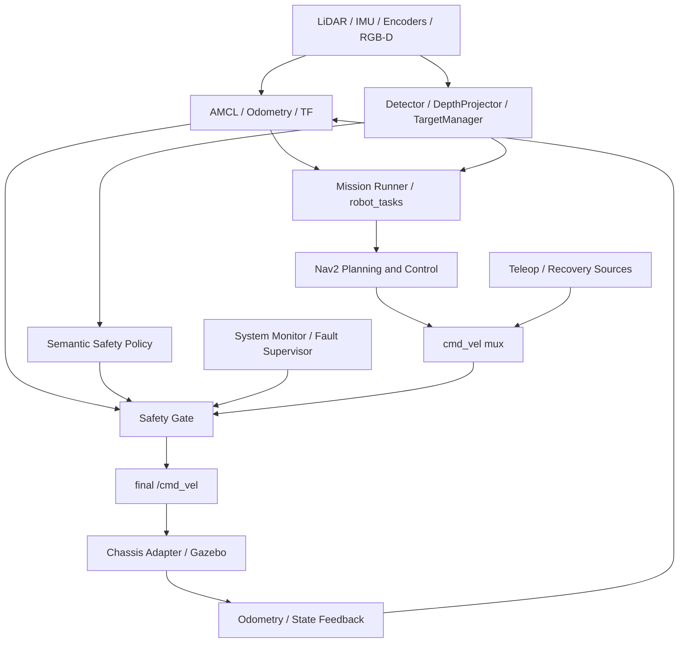

# ROS2 工厂巡检 AMR 自主导航与巡检系统

ROS2 Factory Patrol AMR - Navigation, Perception, Task Execution and Safety

这是一个基于 ROS2 Jazzy 与 C++17 构建的低速工厂巡检 AMR 系统。项目集成 AMCL
定位、Nav2 路径规划与局部控制、RGB-D 环境感知、目标管理、巡检任务、速度仲裁、
Safety Gate、底盘通信及里程计反馈，形成从传感器输入到运动执行与状态反馈的完整闭环。

当前定量验证环境为 WSL2、Ubuntu 24.04、ROS2 Jazzy 和 Gazebo 仿真。仓库保留可重复的
启动入口、静态与运行时检查、单元测试以及 JSON/CSV Benchmark 产物；不把仿真结果表述为
实体机器人结论。

## 核心能力

| 领域 | 实现 |
| --- | --- |
| 定位与 TF | AMCL、`map -> odom -> base_footprint -> base_link`、定位健康监控与重定位流程。 |
| 导航 | Nav2 global/local planner、controller、costmap、恢复行为与 navigation action adapter。 |
| 底盘与反馈 | Mock/Serial/UDP backend、协议编解码、ros2_control adapter、odom 与 chassis state。 |
| RGB-D 感知 | RGB/Depth/CameraInfo、可替换 Detector backend、DepthProjector 与 observation-time TF2。 |
| 目标管理 | `map` frame 关联、确认、丢失、退役、EMA 与稳定 target ID 生命周期。 |
| 巡检任务 | 语义事件、Observation Pose、Nav2 goal、完成反馈与重复任务抑制。 |
| 运动安全 | cmd_vel mux、watchdog、急停、人员距离/区域策略与最终 Safety Gate。 |
| Diagnostics | Camera、Depth、Detector、TF、Pipeline 健康状态及 fault supervisor 联动。 |
| 工程验证 | 21 个 ROS package、单元/集成测试、静态检查、仿真 smoke test 和可重复 Benchmark。 |

## 系统架构



关键权限边界：

- Nav2 负责路径规划与运动控制，不被自定义视觉导航替代。
- `robot_tasks` 把感知事件转换为 Observation Pose 和 Nav2 action，不直接控制底盘。
- Perception 不发布 `/cmd_vel` 或 `/nav2_cmd_vel`，只发布目标、任务与安全语义。
- cmd_vel mux 负责速度源仲裁；`cmd_vel_safety_gate` 是最终速度权限点。
- Safety Gate 综合急停、watchdog、底盘、定位、故障和感知安全状态后发布 `/cmd_vel`。
- Detector backend、DepthProjector、TargetManager 与安全策略保持模块化，可独立测试和替换。

详细节点与数据流见 [系统架构](docs/architecture.md)。

## 已验证结果

以下数据来自仓库中的固定 [Benchmark JSON](src/robot_experiments/results/factory_patrol_phase8_20260815_011022.json)
和 [CSV](src/robot_experiments/results/factory_patrol_phase8_20260815_011022.csv)，环境为 WSL2/Gazebo、
CPU OpenCV-DNN YOLOX-S、640 x 640 Detector 输入。

| 指标 | 结果 |
| --- | --- |
| Detector processing latency | mean `526.189 ms`，P95 `568.830 ms` |
| 3D localization error | RMSE `0.02351 m`，P95 `0.05239 m` |
| Detection -> Nav2 goal | mean `2.050 s` |
| Safety STOP response | mean `0.1806 s`，P95 `0.214 s` |
| Visual inspection mission | `5/5` 成功，`0` 次 false mission start |
| Invalid depth rejection | `20/20` 正确拒绝 |
| Speed limiting | `0.35 -> 0.15 m/s`，响应 `0.226 s` |
| 软件测试基线 | `21` packages，`648` tests，`0` errors/failures/skipped |

百分位使用 nearest-rank 规则；样本定义、排除项、原始分布和局限见
[实验与 Benchmark 报告](docs/experiment_report.md)。

## 主要子系统

### 定位与 TF

AMCL 使用 `/scan` 和静态地图维护 `map -> odom`；底盘或仿真提供
`odom -> base_footprint`，URDF 提供 `base_footprint -> base_link` 及传感器固定变换。
`localization_health_monitor_node` 结合 `/amcl_pose` 新鲜度、covariance 和 TF 可用性输出
`OK / UNSTABLE / LOST / RECOVERING / RECOVERED` 状态。

RGB-D 外参由 robot description 统一定义：

```text
base_link -> camera_link -> camera_color_optical_frame
```

`camera_color_optical_frame` 使用 ROS optical-frame 约定，Gazebo sensor pose 与 Xacro
保持一致。详见 [定位系统](docs/localization.md) 和 [仿真场景](docs/simulation_scenarios.md)。

### Nav2 导航

仓库提供 basic/advanced Nav2 配置、AMCL、global/local costmap、RPP/MPPI controller 配置和
恢复行为。任务层通过既有 navigation adapter 提交目标，不绕开 Nav2。Pure Pursuit 与
Stanley 位于独立实验包，不替代发布配置中的 Nav2 controller。

### 底盘与运动反馈

`robot_hardware` 统一 Mock、Serial、UDP 和 ros2_control 接口，负责速度命令编码、heartbeat、
故障状态、里程计及 covariance 发布。仿真和无硬件闭环可使用 Mock backend；实体串口/UDP
参数与标定值需要现场确认。详见 [底盘通信协议](docs/chassis_protocol.md) 和
[底盘标定](docs/calibration.md)。

### RGB-D 感知与目标管理

Gazebo 发布 RGB、Depth 和 CameraInfo。Detector 默认使用 CPU OpenCV-DNN YOLOX-S，输出标准
`vision_msgs/msg/Detection2DArray`。DepthProjector 对 ROI 内深度做有效性筛选和鲁棒统计，
再使用 CameraInfo 内参与观测时间戳对应的 TF 投影到 `map` frame。

TargetManager 对三维观测执行距离关联、确认、丢失与退役管理，并发布稳定目标、Marker、巡检
事件和人员安全事件。Detector 是可替换 backend，目标管理和任务逻辑不依赖特定模型实现。

### 巡检任务

目标达到确认条件后可产生 `INSPECTION_REQUIRED`。`robot_tasks` 计算带
`standoff_distance` 的 Observation Pose，经 navigation adapter 提交 Nav2 goal；到达后发布
状态并回写 `PROCESSED`，避免同一目标重复触发任务。

### Safety Gate 与 Diagnostics

人员安全策略根据距离、危险区域、目标状态和 hysteresis 产生 `CLEAR / SPEED_LIMIT / STOP`
语义事件。最终动作仍由 Safety Gate 完成，Perception 没有速度发布权。Camera、CameraInfo、
Depth、Detector、TF 和 Pipeline diagnostics 接入 system monitor 与 fault supervisor，沿既有
故障链影响 Safety Gate，不改变速度权限边界。

## 软件包结构

| Package | 责任 |
| --- | --- |
| `robot_bringup` | 系统级 launch、参数组合和 Factory Patrol 入口。 |
| `robot_description` | URDF/Xacro、传感器与 TF 固定结构。 |
| `robot_navigation` | AMCL、Nav2 配置、定位健康与 navigation adapter。 |
| `robot_path_tracking` | Pure Pursuit / Stanley 独立路径跟踪实验。 |
| `robot_hardware` | 底盘 backend、协议、ros2_control、odom 与状态反馈。 |
| `robot_sensors` | LiDAR、IMU 等传感器数据适配。 |
| `robot_simulation` | Gazebo worlds、bridge、fixtures、场景配置与 RViz。 |
| `robot_perception` | Detector、DepthProjector、TargetManager、安全策略与 diagnostics。 |
| `robot_tasks` | 巡检、设施操作、任务编排和恢复逻辑。 |
| `robot_teleop` | teleop、cmd_vel mux、Safety Gate 与安全状态处理。 |
| `robot_utils` | 系统监控与故障监督。 |
| `robot_experiments` | Benchmark 配置、采样、统计与固定结果。 |
| `robot_interfaces*` | 按 core/navigation/mission/facility/fleet/business/site/perception 划分的接口。 |

## 关键 ROS 接口

| Topic | Type / 用途 |
| --- | --- |
| `/scan` | `sensor_msgs/msg/LaserScan`，AMCL 与 costmap 输入。 |
| `/odom` | `nav_msgs/msg/Odometry`，底盘运动反馈。 |
| `/camera/color/image_raw` | `sensor_msgs/msg/Image`，RGB 图像。 |
| `/camera/depth/image_raw` | `sensor_msgs/msg/Image`，深度图像。 |
| `/camera/color/camera_info` | `sensor_msgs/msg/CameraInfo`，相机内参。 |
| `/perception/detections_2d` | `vision_msgs/msg/Detection2DArray`。 |
| `/perception/objects_3d` | `robot_interfaces_perception/msg/DetectedObject3D`。 |
| `/perception/events` | `robot_interfaces_perception/msg/PerceptionEvent`。 |
| `/perception/safety_event` | `robot_interfaces_perception/msg/PerceptionSafetyEvent`。 |
| `/perception/diagnostics` | `diagnostic_msgs/msg/DiagnosticArray`。 |
| `/inspection/status` | 巡检任务状态。 |
| `/localization/health` | 定位健康摘要。 |
| `/nav2_cmd_vel` | Nav2 经适配后的候选速度。 |
| `/cmd_vel` | Safety Gate 输出的最终底盘速度。 |

## 快速开始

依赖 Ubuntu 24.04、ROS2 Jazzy desktop 及项目 package 所声明的系统依赖。

```bash
git clone https://github.com/LiuKaiDev/ros2-factory-patrol-amr.git
cd ros2-factory-patrol-amr

source /opt/ros/jazzy/setup.bash
rosdep install --from-paths src --ignore-src -r -y
colcon build --symlink-install
source install/setup.bash
```

准备 Detector 模型。脚本下载 OpenCV Zoo YOLOX-S ONNX 到用户 cache 并校验 SHA-256；权重不
提交到仓库，普通 launch 也不会隐式下载。

```bash
bash scripts/prepare_detector_model.sh
```

启动基础 Factory Patrol Gazebo + RViz：

```bash
bash scripts/run_factory_patrol_demo.sh --launch
```

直接使用 launch：

```bash
ros2 launch robot_bringup factory_patrol_demo.launch.py \
  gui:=true use_rviz:=true
```

## Demo

| 场景 | 命令 | 重点观察 |
| --- | --- | --- |
| 视觉巡检 | `bash scripts/run_factory_patrol_demo.sh --visual-inspection` | detections、managed target、Observation Pose、Nav2 result。 |
| 人员安全 | `bash scripts/run_factory_patrol_demo.sh --perception-safety` | safety event、Safety Gate state、最终 `/cmd_vel`。 |
| 感知诊断 | `bash scripts/run_factory_patrol_demo.sh --perception-diagnostics` | pipeline diagnostics 与 fault propagation。 |
| 多点巡检 | `bash scripts/run_factory_patrol_multipoint_demo.sh` | station sequence、mission state、Nav2 goals。 |
| 障碍物 | `bash scripts/run_factory_patrol_obstacle_demo.sh` | scan、costmap 与局部绕障。 |
| 定位恢复 | `bash scripts/run_factory_patrol_localization_recovery_demo.sh` | localization health 与 `/initialpose` 恢复。 |

完整启动参数、成功判据和观察 Topic 见 [Demo 手册](docs/demo.md)。

## 测试与验证

构建与测试：

```bash
source /opt/ros/jazzy/setup.bash
colcon build --symlink-install
source install/setup.bash
colcon test
colcon test-result --verbose
```

主要静态检查：

```bash
bash scripts/check_project_showcase_readiness.sh
bash scripts/check_robot_interfaces_split.sh
bash scripts/check_factory_patrol_assets.sh
bash scripts/check_nav2_costmap_obstacle_layer.sh
bash scripts/check_localization_health.sh
bash scripts/check_chassis_odom_calibration.sh
bash scripts/check_safety_state_machine.sh
bash scripts/check_factory_patrol_demo_workflows.sh
```

仿真运行时检查：

```bash
bash scripts/check_factory_patrol_runtime_topics.sh
bash scripts/check_factory_patrol_detector_runtime.sh
bash scripts/check_factory_patrol_target_manager_runtime.sh
bash scripts/check_factory_patrol_visual_inspection_runtime.sh
bash scripts/check_factory_patrol_perception_safety_runtime.sh
bash scripts/check_factory_patrol_perception_diagnostics_runtime.sh
```

复现完整 Benchmark：

```bash
bash scripts/run_factory_patrol_benchmarks.sh
```

运行器要求 ROS2 环境和已构建 workspace，检查资产、配置与 Detector 模型后，在隔离的 DDS
domain 和 Gazebo partition 中运行各 profile。该过程耗时较长；只修改文档或检查器时无需
重新生成固定结果。

## Known Limitations

- 当前定量数据来自 WSL2/Gazebo 仿真，没有实体机器人性能或安全认证结论。
- Detector 当前是 CPU OpenCV-DNN YOLOX-S，性能受主机 CPU 与 WSL 负载影响。
- 静态目标 Benchmark 中 EMA 没有改善稳定性，不据此声称滤波收益。
- 长时间运行曾观察到偶发 target re-identification；当前关联主要依赖空间距离与生命周期。
- Benchmark 中出现过可恢复的 perception/TF health 瞬态告警，原始结果保留这些记录。
- Gazebo world pose 与 bridged wheel odometry 存在同步限制，测试通过明确的 settle/pose 确认处理。
- 视觉巡检当前按静态目标与静态 Observation Pose 设计，动态人员跟随不在能力范围内。
- 实体底盘的相机外参、轮径、轮距、covariance、串口/UDP 参数仍需现场标定和验证。

## 文档

- [文档索引](docs/README.md)
- [系统架构](docs/architecture.md)
- [Demo 手册](docs/demo.md)
- [导航系统](docs/navigation.md)
- [定位系统](docs/localization.md)
- [控制系统](docs/control.md)
- [Safety 状态机](docs/safety_state_machine.md)
- [仿真场景](docs/simulation_scenarios.md)
- [实验与 Benchmark 报告](docs/experiment_report.md)
- [项目技术总结](docs/project_summary.md)
- [验证脚本清单](scripts/README.md)

## License

项目代码采用 [MIT License](LICENSE)。第三方模型与资源遵循各自目录中的 LICENSE 和
ATTRIBUTION 文件。
