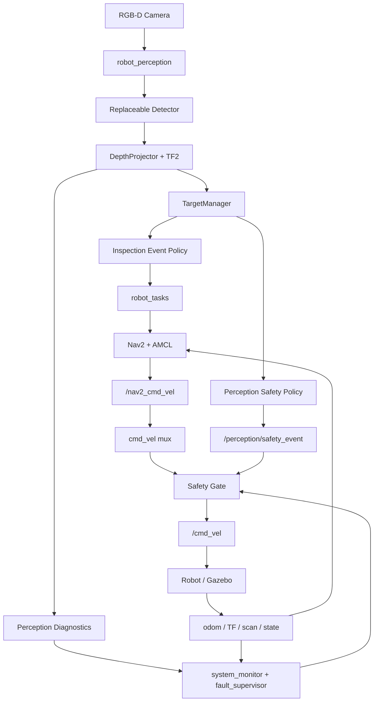

# ROS2 工厂巡检 AMR 自主导航与视觉感知系统

> ROS2 Factory Patrol AMR with Visual Perception, Navigation and Safety Integration

这是一个基于 ROS 2 Jazzy 的低速工厂巡检 AMR 系统。项目在已有 Nav2、AMCL
定位、速度仲裁和 Safety Gate 闭环的基础上，接入 RGB-D 视觉感知，通过目标检测、
鲁棒深度恢复和 TF2 完成目标三维定位，再由 `TargetManager`、视觉巡检任务和人员
安全事件把视觉结果接入任务与安全闭环。

当前验证环境为 **WSL2、Ubuntu 24.04、ROS 2 Jazzy 和 Gazebo simulation**。
本文中的性能与行为结果均来自软件仿真，不代表真实工厂或实体机器人部署验收。

项目的主角是 AMR 的完整闭环，视觉模型只是可替换的 Perception 输入模块：

```text
Perception -> Spatial Understanding -> Decision -> Navigation -> Control -> Safety
```

原有控制权保持不变：

```text
Mission / Goal -> Nav2 -> cmd_vel mux -> Safety Gate -> Robot
```

`robot_perception` 只发布检测、几何、目标和语义安全事件；**Perception never publishes
`/cmd_vel` or `/nav2_cmd_vel`.** 最终速度仍由现有 cmd_vel mux 和 Safety Gate 决定。

## 核心能力

- ROS2 Jazzy 多 package AMR 软件架构与 Factory Patrol Gazebo 仿真。
- Nav2 / AMCL 导航定位，以及现有速度仲裁、watchdog、estop 和 Safety Gate。
- 640x480、15 Hz 的 RGB-D Camera，提供 RGB、Depth、CameraInfo 和完整 TF 链。
- 可替换的 OpenCV-DNN YOLOX-S Detector，输出标准 `vision_msgs` `Detection2DArray`。
- Robust Depth Sampling：从检测框中心 ROI 过滤无效深度并取 median。
- 通过 CameraInfo 内参和 TF2 将相机坐标系点转换到 `map`。
- `TargetManager` 的多帧确认、空间关联、丢失、处理、冷却和重复任务抑制。
- 由 `robot_tasks` 管理的 Visual Inspection Mission、Observation Pose 和 Nav2 Approach。
- 人员距离与危险区域判断，生成 `PerceptionSafetyEvent` 并接入最终 Safety Gate。
- 独立的 Camera、Detector、Depth、TF、Pipeline Diagnostics 与故障恢复检查。
- 可复现的 Evaluation / Benchmark，以及提交到仓库的 JSON / CSV 结果。

## 已验证结果

### Gazebo / WSL Simulation Benchmark

数据源是提交到仓库的 [Benchmark JSON](src/robot_experiments/results/factory_patrol_phase8_20260815_011022.json)
和 [CSV](src/robot_experiments/results/factory_patrol_phase8_20260815_011022.csv)。该轮运行使用
headless `factory_patrol.sdf`、CPU OpenCV-DNN YOLOX-S、640x640 Detector 输入、
640x480 RGB-D（15 Hz）和置信度阈值 `0.45`。

| 指标 | 样本数 | Mean | P50 | P95 | Max |
| --- | ---: | ---: | ---: | ---: | ---: |
| Detector inference | 30 | 526.189 ms | 519.714 ms | 568.830 ms | 656.778 ms |
| 3D localization error | 30 | 0.02045 m | 0.01645 m | 0.05239 m | 0.07075 m |
| Detection to confirmation | 5 | 1.970 s | 2.023 s | 2.405 s | 2.405 s |
| Confirmation to inspection event | 5 | 0.000 s | 0.000 s | 0.000 s | 0.000 s |
| Inspection event to Nav2 goal | 5 | 0.080 s | 0.002 s | 0.385 s | 0.385 s |
| Detection to Nav2 goal | 5 | 2.050 s | 2.034 s | 2.790 s | 2.790 s |
| Safety STOP response | 10 | 0.1806 s | 0.173 s | 0.214 s | 0.214 s |

摘要：

- 3D 定位 RMSE 为 `0.02351 m`（约 2.35 cm），P95 为 `0.05239 m`（约 5.24 cm）。
- Visual Inspection 任务 `5/5` 成功，0 次失败，0 次 false mission starts。
- `20/20` 组无效深度被正确拒绝，`0` 次 false-valid outputs。
- `SPEED_LIMITED` 将真实上游 `0.35 m/s` Nav2 请求限制为 `0.15 m/s`，响应时间 `0.226 s`。
- 长时运行中一个静态目标曾被分配两个 target ID；任务层 duplicate suppression
  阻止了重复 mission start。
- 32 组静态目标观测的原始 x/y/z 标准差为 `0.00161 / 0.00167 / 0.00540 m`，
  EMA 为 `0.00181 / 0.00197 / 0.00607 m`，本轮没有证明 EMA 带来稳定性改善。
- 三个高负载 mission trial 共记录 13 个瞬时非 OK `perception/tf` 样本，均恢复，
  未发出失败 lookup 的坐标，所有任务仍完成。

最新完整软件基线为 **21 ROS 2 packages、648 tests、0 errors、0 failures、0 skipped**。
这是仿真/软件验证结果，不是硬件验收结果。

## 系统架构（Closed-Loop Pipeline）



Factory Patrol 仿真节点把 mux 和安全门控组合在一个进程中，但权限边界不变：
其他安全输入（estop、watchdog、定位、底盘、scan、手动接管和 legacy safety state）
与 Perception 限制一起按最严格状态解析。Perception 与 velocity controller 是两个
不同的职责边界，架构中不存在 `Perception -> /cmd_vel` 直连。

详细说明见 [docs/architecture.md](docs/architecture.md) 和
[docs/safety_state_machine.md](docs/safety_state_machine.md)。

## 视觉感知与三维定位

`robot_perception` 负责 Detector 适配、Depth 投影、Geometry/TF、目标管理、巡检事件、
人员安全策略和 Diagnostics。Detector 只输出标准 `Detection2DArray`，因此深度、TF、
Tracking、Mission 和 Safety 逻辑不依赖 YOLO 专用输出。

```text
RGB
  ↓
Detector
  ↓
2D bbox + Depth + CameraInfo
  ↓
Robust Depth
  ↓
3D Point in camera_color_optical_frame
  ↓
TF2
  ↓
map-frame position
```

### Robust Depth Projection

投影器不会只读取 bbox 中心的单个像素，而是采样检测框中心的 `0.3` 区域：

```text
bbox center ROI
    -> 过滤 0 / NaN / Inf / 超出 0.2-8.0 m 的值
    -> 至少保留 5 个有效样本
    -> median
```

使用 `CameraInfo` 内参后，针孔投影公式保持如下：

```text
X = (u - cx) * Z / fx
Y = (v - cy) * Z / fy
Z = depth
```

其中 `(u, v)` 是检测框参考像素，`fx, fy, cx, cy` 来自 `CameraInfo`，`Z` 是鲁棒
深度。输出点位于 `camera_color_optical_frame`，随后由 TF2 转换到 `map`。深度或
内参无效时不产生 3D 点，也不会凭空生成目标。

## 坐标系与 TF

```text
map
 ↓
odom
 ↓
base_footprint
 ↓
base_link
 ↓
camera_link
 ↓
camera_color_optical_frame
```

RGB-D Camera 的唯一外参由 robot description 中的 Xacro/URDF 定义，并与 Factory
Patrol Gazebo 模型保持一致。`camera_color_optical_frame` 使用 ROS optical-frame
约定：x 向右、y 向下、z 向前。

几何节点使用与图像观测对应的 observation timestamp 查询 TF2，再把点转换到 `map`。
不会用 latest TF 掩盖时间同步错误。未启用 Nav2 时，仿真 profile 发布 identity
`map -> odom`；启用 Nav2 时由 AMCL 提供权威定位。

## 目标管理

目标状态为：

```text
TENTATIVE -> CONFIRMED -> LOST -> PROCESSED
```

`TargetManager` 使用 class-aware 3D spatial association、多帧确认、丢失计数、EMA、
processed cooldown 和 event suppression。短时验证展示了稳定 ID 与同 ID reacquisition，
但长时 Benchmark 中一个静态物理目标曾产生两个 ID。因此项目不宣称永久稳定
的 appearance ReID；任务层仍能抑制活动 mission 期间的重复事件。

## 视觉引导巡检

单帧检测不会直接启动任务。allowlisted 且已确认的目标触发 `INSPECTION_REQUIRED`，
`robot_tasks` 验证事件、在 `map` 中规划约 `1.2 m` 的 Observation Pose，使机器人朝向
目标，并通过现有 `/navigate_sequence` adapter 调用 Nav2：

```text
CONFIRMED Target
        ↓
INSPECTION_REQUIRED
        ↓
robot_tasks
        ↓
Observation Pose Planner (standoff 1.2 m)
        ↓
Nav2
        ↓
Arrival
        ↓
PROCESSED
```

目标中心是物体坐标，不是安全停车点；Observation Pose 让机器人在可配置距离处朝向
目标，避免直接驶入目标。只有导航成功才产生 `INSPECTION_COMPLETED` 并把目标标记为
`PROCESSED`。一次仿真 smoke run 返回 Nav2 `SUCCEEDED`，最终机器人与目标距离
`1.342032 m`；Nav2 goal tolerance 造成其与请求 standoff 的差异。正式 Benchmark 测量
的是 mission success 和 latency，并未统计 physical standoff error。

## 人员安全联动

对当前可见且符合条件的人员目标，系统在 `map` 中计算平面距离并判断 danger zone，
发布 `/perception/safety_event`：

| 条件 | 语义状态 | Safety Gate 行为 |
| --- | --- | --- |
| 距离 `> 3.0 m` | `CLEAR` / normal | 不增加 Perception 限制 |
| 距离 `1.5-3.0 m` | `SPEED_LIMITED` | 限制到配置的低速 |
| 距离 `< 1.5 m` | `STOP` | 发布零最终速度 |
| 位于 danger zone | `STOP` | 发布零最终速度 |

边界使用 hysteresis，恢复需要连续三个有效 clear observation。过期的 Perception
限制不能解除其他仍然有效的安全来源。这是 supervisory simulation behavior，不是
functional-safety certification；Perception 仍不拥有速度发布权，Safety Gate 仍是最终
velocity authority。

## 感知诊断与故障处理

标准 `/perception/diagnostics` 流包含以下独立状态：

```text
perception/camera_rgb
perception/camera_depth
perception/camera_info
perception/detector
perception/tf
perception/depth_quality
perception/pipeline
```

```text
Perception diagnostics -> system_monitor -> fault_supervisor -> Safety Gate
```

Camera freshness、CameraInfo 有效性、Detector health、observation-time TF 和 depth
quality 分开诊断，因此“感知故障”不会被误判为空场景。故障注入会中断 RGB、Depth、
无效深度、观测时刻 TF 和 Detector，并验证诊断恢复；无效或过期输入会抑制下游坐标
和任务触发。

详细故障场景见 [docs/simulation_scenarios.md](docs/simulation_scenarios.md)。

## 性能评估

Benchmark runner 使用隔离的 DDS domain 和 Gazebo partition 启动多个 headless profile，
输出带时间戳的 JSON / CSV 到 `src/robot_experiments/results/`。百分位数、排除项和解释
见 [docs/experiment_report.md](docs/experiment_report.md)。上方指标来自固定提交产物，不
因 README 中文化而重新生成或调整。

## 软件包结构

| Package | 职责 |
| --- | --- |
| `robot_bringup` | 组合 Factory Patrol 仿真、Nav2、任务、Perception 和监控 profile。 |
| `robot_description` | Xacro/URDF 机器人模型、Camera extrinsic、optical frame 和机器人资源。 |
| `robot_simulation` | Gazebo world、ROS-Gazebo bridge、fixtures、配置和 RViz 视图。 |
| `robot_navigation` | Nav2、AMCL、地图、costmap、定位健康和导航参数。 |
| `robot_teleop` | 速度源仲裁、手动输入、Safety Gate、watchdog、estop 和速度限制。 |
| `robot_tasks` | Mission lifecycle、Observation Pose 规划、视觉巡检和 Nav2 action 所有权。 |
| `robot_perception` | Detection、Depth/TF geometry、TargetManager、语义策略和 Diagnostics。 |
| `robot_utils` | 系统健康聚合和故障监督。 |
| `robot_experiments` | 可重复 Benchmark probe、统计和 JSON/CSV 输出。 |
| `robot_interfaces_perception` | 3D 目标、Mission event 和语义 Safety message 定义。 |
| `robot_interfaces*` | Core、navigation、mission、facility、fleet、business 和 site interfaces。 |

当前 workspace 包含 21 个 ROS 2 packages。

## 关键 ROS Topics

| 类别 | Topic | Type |
| --- | --- | --- |
| Camera | `/camera/color/image_raw` | `sensor_msgs/msg/Image` |
| Camera | `/camera/depth/image_raw` | `sensor_msgs/msg/Image` (`32FC1`) |
| Camera | `/camera/color/camera_info` | `sensor_msgs/msg/CameraInfo` |
| Perception | `/perception/detections_2d` | `vision_msgs/msg/Detection2DArray` |
| Perception | `/perception/objects_3d` | `robot_interfaces_perception/msg/DetectedObject3D` |
| Perception | `/perception/events` | `robot_interfaces_perception/msg/PerceptionEvent` |
| Perception safety | `/perception/safety_event` | `robot_interfaces_perception/msg/PerceptionSafetyEvent` |
| Debug | `/perception/debug_image` | `sensor_msgs/msg/Image` |
| Debug | `/perception/markers` | `visualization_msgs/msg/Marker` |
| Diagnostics | `/perception/diagnostics` | `diagnostic_msgs/msg/DiagnosticArray` |
| Inspection | `/inspection/observation_pose` | `geometry_msgs/msg/PoseStamped` |
| Inspection | `/inspection/observation_marker` | `visualization_msgs/msg/Marker` |
| Inspection | `/inspection/status` | `std_msgs/msg/String` |
| Safety/control | `/safety/state`, `/safety/reason` | `std_msgs/msg/String` |
| Control | `/nav2_cmd_vel`, `/cmd_vel` | `geometry_msgs/msg/Twist` |

Camera 图像使用 `camera_color_optical_frame` 作为相关 frame ID。RGB-D 的仿真分辨率为
640x480、发布频率为 15 Hz；Depth 编码为 `32FC1`。Detector 默认输入 640x640，
置信度阈值 `0.45`，NMS `0.5`。深度有效范围为 `0.2-8.0 m`，ROI 比例 `0.3`，至少
需要 5 个有效样本。Tracking 默认确认 3 帧、丢失 5 帧、最大匹配距离 `0.5 m`、
EMA `alpha=0.4`、cooldown `10 s`。视觉巡检 standoff 参数为 `1.2 m`，人员安全
slow/stop 阈值为 `3.0 m` / `1.5 m`，低速为 `0.15 m/s`。

## 自定义 Interface

- [DetectedObject3D.msg](src/robot_interfaces_perception/msg/DetectedObject3D.msg) 携带
  `map` frame 中的 target ID、类别、置信度、3D 位置、深度有效性和生命周期状态。
  状态常量为 `TENTATIVE`、`CONFIRMED`、`LOST`、`PROCESSED`。
- [PerceptionEvent.msg](src/robot_interfaces_perception/msg/PerceptionEvent.msg) 携带
  目标确认、巡检请求和巡检完成事件，以及 `map` frame pose。事件常量包括
  `TARGET_CONFIRMED`、`INSPECTION_REQUIRED` 和 `INSPECTION_COMPLETED`。
- [PerceptionSafetyEvent.msg](src/robot_interfaces_perception/msg/PerceptionSafetyEvent.msg)
  携带 `CLEAR`、`PERSON_NEAR`、`PERSON_TOO_CLOSE`、`PERSON_IN_DANGER_ZONE` 语义、
  requested safety state、distance、source 和 reason；它不携带 velocity command。

## 快速开始

前置条件：Ubuntu 24.04、ROS 2 Jazzy desktop，以及可由 `rosdep` 解析的项目依赖。

```bash
source /opt/ros/jazzy/setup.bash
rosdep install --from-paths src --ignore-src -r -y
colcon build --symlink-install
source install/setup.bash
```

准备 Detector 模型并启动一次视觉巡检 Demo：

```bash
bash scripts/prepare_phase3_detector_model.sh
bash scripts/run_factory_patrol_demo.sh --phase5
```

模型脚本把官方 OpenCV Zoo YOLOX-S ONNX 文件下载到用户 cache，并校验 SHA-256：

```text
c5c2d13e59ae883e6af3b45daea64af4833a4951c92d116ec270d9ddbe998063
```

权重不会提交到仓库，普通 launch 也不会自动下载。当前 backend 是 CPU OpenCV-DNN；
CUDA、TensorRT 和 ONNX Runtime **尚未实现**。

## Demo

### 1. RGB-D Detection 与 3D Localization

```text
RGB-D -> Detection2D -> robust depth -> optical-frame point
      -> observation-time TF2 -> map-frame target -> RViz marker
```

```bash
ros2 launch robot_bringup factory_patrol_demo.launch.py \
  gui:=true use_rviz:=true use_detector:=true geometry_input_mode:=detector
```

检查 `/perception/detections_2d`、`/perception/objects_3d`、`/perception/debug_image`
和 `/perception/markers`。

### 2. Visual Inspection / Nav2 Approach

```text
CONFIRMED -> INSPECTION_REQUIRED -> robot_tasks -> observation pose
          -> NavigateSequence -> Nav2 -> arrival -> PROCESSED
```

```bash
bash scripts/run_factory_patrol_demo.sh --phase5
```

### 3. Person Safety Integration

```text
Person -> TargetManager -> PerceptionSafetyPolicy
       -> /perception/safety_event -> Safety Gate -> final /cmd_vel
```

```bash
bash scripts/run_factory_patrol_demo.sh --phase6
```

该 profile 覆盖 `CLEAR`、`SPEED_LIMITED`、距离 `STOP`、danger-zone `STOP` 和恢复。

### 4. Perception Fault Handling

```bash
bash scripts/run_factory_patrol_demo.sh --phase7
```

在另一个已 source 的 shell 中运行：

```bash
bash scripts/check_factory_patrol_perception_diagnostics_runtime.sh
```

该 probe 注入 RGB interruption、Depth interruption、invalid depth、observation-time
TF failure 和 Detector failure，并检查诊断恢复。Multipoint、temporary-obstacle 和
localization-recovery workflow 仍记录在
[scripts/README.md](scripts/README.md)。

<!-- Existing workflow-check compatibility marker: Phase 5B. -->

## 测试与验证

### Validation Scripts

```bash
source /opt/ros/jazzy/setup.bash
source install/setup.bash

colcon test
colcon test-result --verbose

bash scripts/check_factory_patrol_assets.sh
bash scripts/check_factory_patrol_runtime_topics.sh
bash scripts/check_factory_patrol_target_manager_runtime.sh
bash scripts/check_factory_patrol_visual_inspection_runtime.sh
bash scripts/check_factory_patrol_perception_safety_runtime.sh
bash scripts/check_factory_patrol_perception_diagnostics_runtime.sh
bash scripts/check_safety_state_machine.sh
bash scripts/check_project_showcase_readiness.sh
```

Runtime scripts 需要在另一个已 source 的 shell 中启动匹配的 Demo profile。完整脚本清单
见 [scripts/README.md](scripts/README.md)。最新完整基线为 **21 packages, 648 tests,
0 errors, 0 failures, 0 skipped**。

## 复现 Benchmark

```bash
source /opt/ros/jazzy/setup.bash
source install/setup.bash
bash scripts/run_factory_patrol_benchmarks.sh
```

运行器会为多个 headless profile 使用隔离的 DDS domain 和 Gazebo partition，并把带时间
戳的 JSON 与 CSV 写入 `src/robot_experiments/results/`。运行时间会随主机负载变化。本文
引用的固定产物为：

- [factory_patrol_phase8_20260815_011022.json](src/robot_experiments/results/factory_patrol_phase8_20260815_011022.json)
- [factory_patrol_phase8_20260815_011022.csv](src/robot_experiments/results/factory_patrol_phase8_20260815_011022.csv)

以上固定产物随对应实验提交保存，不因后续文档更新而重新生成或改写。

## 关键设计决策

1. **RGB-D 而不是 RGB-only：** metric depth 提供显式 3D 坐标、standoff goal 和距离策略，
   不需要猜测单目尺度。
2. **Replaceable detector：** `Detection2DArray` 把 backend inference 与深度、TF、目标、
   mission 和 safety 逻辑解耦。
3. **先验证 Geometry：** deterministic synthetic bbox 让相机内参、optical convention、
   深度过滤和 TF 可以独立测试。
4. **Perception 不发布速度：** semantic policy 与最终 Safety Gate 分离，保留所有既有
   safety source 和 control ownership。
5. **Observation Pose 而非目标中心：** 机器人在安全、朝向目标的 standoff 停车，而不是
   驶入物体坐标。
6. **只用确认目标：** 多帧证据和 task suppression 避免单帧检测或重复事件启动重复任务。
7. **诊断状态独立：** 失败或过期的 Perception 是 unknown，不是“环境为空且安全”的证据。
8. **延后加速与 ReID：** TensorRT 和 advanced identity tracking 会扩大部署范围，因此
   不纳入当前已测 baseline。

## 已知限制（Known Limitations）

- **仅仿真：** 定量结果来自 WSL2/Gazebo，不是实体硬件。
- **CPU Detector：** OpenCV-DNN YOLOX-S 受 CPU 约束，P95 为 `568.830 ms`。
- **目标身份：** 长时运行中一个静态目标产生过两个 ID；任务层抑制了重复任务，尚无
  appearance ReID。
- **EMA 结果：** 32 组静态样本中，过滤后的标准差略高于原始数据，不能宣称稳定性改善。
- **TF 瞬态：** 三个高负载 mission trial 记录 13 个非 OK TF 诊断样本，随后恢复且没有
  永久任务失败。
- **Gazebo 位姿/里程计对齐：** 被动模型 settling 和 bridged wheel odometry 可能使用
  不同 origin，测得几何误差包含此影响。
- **静态巡检目标：** Mission 规划固定 Observation Pose，不是 moving-target pursuit
  或 visual servoing。
- **范围边界：** 当前没有 SLAM/VIO upgrade、3D detector、functional-safety
  certification、hardware deployment 或 production object dataset。

## 后续可扩展方向

以下均为后续方向，当前版本**尚未实现**：

- C++ inference，以及经过独立评估的 ONNX Runtime / TensorRT backend。
- 实体机器人标定、部署和真实工厂验证。
- Appearance-aware target re-identification 与更持久的 lifecycle。
- 针对 rosbag replay 和 dynamic target 的自适应滤波评估。
- 更大的工厂目标标注数据集和更多 benchmark 重复试验。
- 带命令、commit、参数和日志的审核后 runtime 截图/视频。
- VLM、Visual SLAM、DeepSORT、ByteTrack 和 semantic segmentation 等能力的专项评估。

## 项目文档

更详细的架构、导航、定位、安全、仿真与实验说明请参阅：

[📚 项目完整文档](docs/README.md)

重点入口：

- [工程项目总结](docs/project_summary.md)
- [详细系统架构](docs/architecture.md)
- [Benchmark 方法与结果](docs/experiment_report.md)
- [Showcase 证据规范](docs/showcase/README.md)
- [Validation 脚本清单](scripts/README.md)
