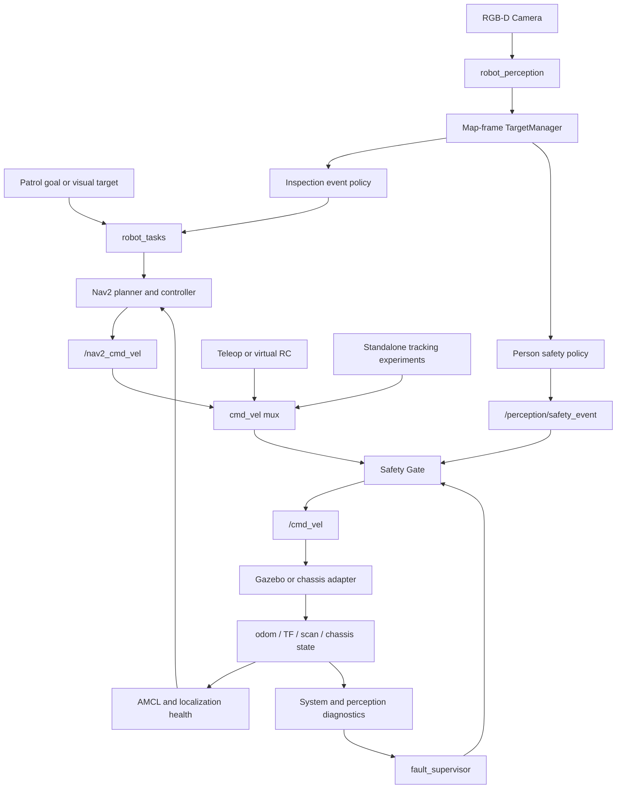

# 系统架构

本项目是一个低速工厂巡检 AMR。导航、控制、安全、感知和诊断路径具有明确的职责边界。
视觉升级扩展了既有的 Nav2 机器人，不替换导航栈，也不创建第二套速度控制器。

## 端到端闭环



真实底盘 bringup 使用 `twist_mux`，再进入 `cmd_vel_safety_gate_node`。Factory Patrol
仿真使用已有的 `cmd_vel_mux_node`，在一个节点中完成速度源选择和相同的最终安全解析，
然后发布 `/cmd_vel`。两种模式都保持以下权限顺序：

```text
candidate commands -> velocity arbitration -> Safety Gate -> final /cmd_vel
```

Perception 发布空间目标、mission event、safety event、marker 和 diagnostics，不发布
`/cmd_vel` 或 `/nav2_cmd_vel`。

## 软件包职责

| Package | 当前职责 |
| --- | --- |
| `robot_bringup` | 组合仿真、导航、任务、感知和监控。 |
| `robot_description` | Xacro/URDF、实体 link、权威 RGB-D 外参和 optical frame。 |
| `robot_hardware` | 底盘协议、mock/serial/UDP backend、driver、kinematics、状态和里程计 covariance。 |
| `robot_sensors` | Laser/IMU 归一化、fake source 和 sensor diagnostics。 |
| `robot_navigation` | Nav2、AMCL、地图、costmap、地图管理和定位健康。 |
| `robot_path_tracking` | 独立的 Pure Pursuit 和 Stanley tracking 实验控制器。 |
| `robot_teleop` | 手动输入、速度 mux、watchdog、estop、速度限制和最终 Safety Gate。 |
| `robot_tasks` | Mission lifecycle、station task、Observation Pose 规划、视觉巡检和 Nav2 action 所有权。 |
| `robot_perception` | Detector adapter、depth/TF geometry、TargetManager、任务/安全策略和 diagnostics。 |
| `robot_simulation` | Gazebo world/bridge、RGB-D sensor、fixtures、语义配置和 RViz view。 |
| `robot_utils` | System monitor 和 fault supervisor。 |
| `robot_experiments` | 可重复 benchmark probe、统计和结果序列化。 |
| `robot_interfaces*` | 按领域拆分的 custom interface，包括 perception target 和 semantic event。 |

## 感知边界

```text
/camera/color/image_raw -> replaceable Detector -> Detection2DArray
                                              + synchronized depth/CameraInfo
                                              -> DepthProjector
                                              -> camera optical point
                                              -> observation-time TF2
                                              -> map-frame observation
                                              -> TargetManager
```

`DetectorBackend` 隔离 OpenCV-DNN YOLOX-S 实现。下游 geometry 只消费标准
`vision_msgs/msg/Detection2DArray`，因此未来替换 detector 不需要修改 projection、
target、task 或 safety 的 message contract。

深度是检测框中心 ROI 中有效样本的 median，而不是单个像素。投影会拒绝无效深度和无效
内参。TF lookup 使用图像 observation timestamp，明确不使用 latest-TF fallback。

共享坐标路径为：

```text
map -> odom -> base_footprint -> base_link -> camera_link
                                             -> camera_color_optical_frame
```

`map` 坐标是目标关联、Observation Goal、机器人与人员距离及配置区域判断的权威坐标。

## TargetManager 与任务所有权

TargetManager 按类别和空间位置分配 ID，并管理：

```text
TENTATIVE -> CONFIRMED -> LOST
                    \-> PROCESSED
```

确认机制避免单帧 detection 启动任务。丢失帧处理支持短时 reacquisition；EMA 在需要时
减少位置突变；processed cooldown 和 task state 抑制重复动作。这是短时空间 tracking，
不是 appearance ReID。较长的 Phase 8 运行中，一个静态目标经历生命周期转换后曾出现两个 ID。

对于符合条件的 confirmed target：

```text
TargetManager
  -> /perception/events (INSPECTION_REQUIRED, map-frame target pose)
  -> robot_tasks visual_inspection_task_node
  -> observation pose planner (configured 1.2 m standoff, face target)
  -> existing /navigate_sequence action
  -> Nav2 NavigateToPose
  -> /nav2_cmd_vel
  -> cmd_vel mux
  -> Safety Gate
  -> /cmd_vel
```

`robot_tasks` 负责 event validation、Observation Pose 规划、action lifecycle、retry
policy 和完成/失败决定。只有导航成功后才发布 `INSPECTION_COMPLETED`。Perception 消费
这个语义完成事件并把 target 标记为 `PROCESSED`；task code 不读取 perception 进程内存。

## 安全职责

Perception policy 只对当前可见且符合条件的人员目标生效，使用 observation-time
`map -> base_link` 计算的 map-frame 平面距离：

| 条件 | Policy result |
| --- | --- |
| `distance > 3.0 m` | `CLEAR` |
| `1.5 m <= distance <= 3.0 m` | `SPEED_LIMITED` |
| `distance < 1.5 m` | `STOP` |
| 目标位于配置的 danger zone | `STOP` |

策略使用 hysteresis，并要求三个 clear observation 才能恢复。它发布
`robot_interfaces_perception/msg/PerceptionSafetyEvent`，不直接裁剪 Twist。Safety Gate
把该语义限制与 watchdog、estop、scan、localization、chassis、manual takeover 和
legacy safety input 按最严格的活动状态合并。

## Diagnostics 与故障语义

```text
/perception/diagnostics -> system_monitor -> fault_supervisor -> Safety Gate
```

独立状态名区分 RGB freshness、Depth freshness、CameraInfo validity、Detector health、
observation-time TF、depth quality 和 aggregate pipeline health。数据缺失、无效或过期时，
不会生成新的点、目标、任务或虚假的 `CLEAR` event。这是 fault-aware supervision，不是
functional-safety certification。

## 仿真与导航权威性

Factory Patrol 同时包含 `factory_patrol.sdf` 和独立的 industrial preview world。主 profile
桥接 RGB-D、scan、IMU、odom、TF 和最终速度，不改变原有机器人几何或 Nav2 栈。

Nav2 禁用时，Perception validation 发布 identity `map -> odom`；Nav2 启用时，AMCL
拥有 `map -> odom`。Gazebo 被动 settling 可能发生在 bridged wheel odometry 开始之前，
因此 world pose 与积分 odom 可能有不同 origin；geometry benchmark 保留这个对齐影响，
不会用 TF fallback 将其隐藏。

## 证据边界

正式定量证据是 [experiment_report.md](experiment_report.md) 中记录的 Phase 8 WSL2/Gazebo
benchmark。`simulation_scenarios.md` 中早期 Phase 2/3/5/6 数值均标记为 smoke run，
不汇总到最终 benchmark。实体硬件行为仍未验证。
