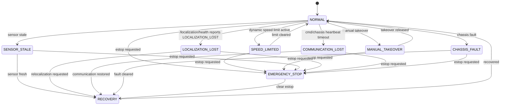

# Safety State Machine

本文档定义低速巡检 AMR 的安全状态机目标形态，并标注当前代码中已实现的部分。Phase 0 只写文档，不修改安全逻辑。

## Current Safety Capabilities

当前仓库已有：

- `cmd_vel_safety_gate_node`：最终 `/cmd_vel` 发布点；
- emergency stop service：`/enable_emergency_stop`、`/clear_emergency_stop`；
- watchdog：muxed cmd_vel 超时输出零速度；
- dynamic speed limit：订阅 `/safety_state` 并限制速度；
- manual takeover 状态：订阅 `/manual_takeover/state`；
- `fault_supervisor_node`：根据 `/system_health` 请求急停或恢复；
- `system_monitor_node`：系统健康监控入口。
- `localization_health_monitor_node`：Phase 4A 发布 `/localization/health`，输出 `LOCALIZATION_UNKNOWN / OK / UNSTABLE / LOST / RECOVERING / RECOVERED`。

完整状态机的命名、事件和任务暂停策略仍需要后续阶段统一。

## State Table

| State | Current / planned | cmd_vel output | Pause mission | Manual reset |
| --- | --- | --- | --- | --- |
| `NORMAL` | current concept | 正常透传经限幅后的速度 | No | No |
| `MANUAL_TAKEOVER` | partial current | 由人工接管链路决定，自动导航应让出控制 | Yes / policy TBD | Usually no |
| `SPEED_LIMITED` | current | 按动态限速裁剪线速度和角速度 | No | No |
| `SENSOR_STALE` | partial current | 输出零速度或降级，取决于传感器类型 | Yes | TBD |
| `LOCALIZATION_LOST` | Phase 4A health output / planned safety integration | Phase 4A 不直接控制；Phase 4B 计划输出零速度 | Phase 4B planned | Depends on relocalization result |
| `CHASSIS_FAULT` | planned unified state | 输出零速度 | Yes | Yes |
| `COMMUNICATION_LOST` | partial current via cmd watchdog / planned chassis heartbeat | 输出零速度 | Yes | Depends on cause |
| `EMERGENCY_STOP` | current | 输出零速度 | Yes | Yes |
| `RECOVERY` | partial current | 仅允许恢复动作或保持零速度 | Yes until recovered | Depends on fault |

## State Diagram

## Phase 4 Plan

- Phase 4A：`/amcl_pose` covariance、AMCL timeout 和 TF 检查进入 `/localization/health`；不直接改 `cmd_vel_safety_gate`，不强行暂停任务。
- Phase 4B planned：将 `LOCALIZATION_LOST` 接入 `cmd_vel_safety_gate` / mission pause，并定义恢复策略。
- 将 safety state 与 task state、localization health、chassis fault 统一建模；
- 明确每类故障是否自动恢复、是否需要人工复位；
- 为每次安全停车记录原因、时间、输入速度和输出速度；
- 将 localization lost、communication lost、chassis fault 接入统一状态机；
- 补充 launch / shell 验收脚本和 RViz 可视化。
