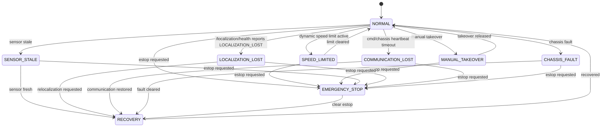

# Safety State Machine

本文档定义低速巡检 AMR 的安全状态机目标形态，并标注当前代码中已实现的部分。Phase 0 只写文档，不修改安全逻辑。

## Current Safety Capabilities

当前仓库已有：

- `cmd_vel_safety_gate_node`：最终 `/cmd_vel` 发布点；
- emergency stop service：`/enable_emergency_stop`、`/clear_emergency_stop`；
- watchdog：muxed cmd_vel 超时输出零速度；
- dynamic speed limit：订阅 `/safety_state` 并限制速度；
- manual takeover 状态：订阅 `/manual_takeover/state`；
- `fault_supervisor_node`：根据 `/system_health` 请求急停或恢复；
- `system_monitor_node`：系统健康监控入口。
- `localization_health_monitor_node`：Phase 4A 发布 `/localization/health`，输出 `LOCALIZATION_UNKNOWN / OK / UNSTABLE / LOST / RECOVERING / RECOVERED`。

完整状态机的命名、事件和任务暂停策略仍需要后续阶段统一。

## State Table

| State | Current / planned | cmd_vel output | Pause mission | Manual reset |
| --- | --- | --- | --- | --- |
| `NORMAL` | current concept | 正常透传经限幅后的速度 | No | No |
| `MANUAL_TAKEOVER` | partial current | 由人工接管链路决定，自动导航应让出控制 | Yes / policy TBD | Usually no |
| `SPEED_LIMITED` | current | 按动态限速裁剪线速度和角速度 | No | No |
| `SENSOR_STALE` | partial current | 输出零速度或降级，取决于传感器类型 | Yes | TBD |
| `LOCALIZATION_LOST` | Phase 4A health output / planned safety integration | Phase 4A 不直接控制；Phase 4B 计划输出零速度 | Phase 4B planned | Depends on relocalization result |
| `CHASSIS_FAULT` | planned unified state | 输出零速度 | Yes | Yes |
| `COMMUNICATION_LOST` | partial current via cmd watchdog / planned chassis heartbeat | 输出零速度 | Yes | Depends on cause |
| `EMERGENCY_STOP` | current | 输出零速度 | Yes | Yes |
| `RECOVERY` | partial current | 仅允许恢复动作或保持零速度 | Yes until recovered | Depends on fault |

## State Diagram



## Phase 4 Plan

- Phase 4A：`/amcl_pose` covariance、AMCL timeout 和 TF 检查进入 `/localization/health`；不直接改 `cmd_vel_safety_gate`，不强行暂停任务。
- Phase 4B planned：将 `LOCALIZATION_LOST` 接入 `cmd_vel_safety_gate` / mission pause，并定义恢复策略。
- 将 safety state 与 task state、localization health、chassis fault 统一建模；
- 明确每类故障是否自动恢复、是否需要人工复位；
- 为每次安全停车记录原因、时间、输入速度和输出速度；
- 将 localization lost、communication lost、chassis fault 接入统一状态机；
- 补充 launch / shell 验收脚本和 RViz 可视化。

## Phase 4B Current Integration

Phase 4B adds a minimal unified safety state integration in `robot_teleop` without
creating a new package or changing the package layout.

Implemented entry points:

- Helper and policy code: `src/robot_teleop/include/robot_teleop/cmd_vel_safety.hpp`
- Final command gate: `src/robot_teleop/src/cmd_vel_safety_gate_node.cpp`
- Launch parameters: `src/robot_teleop/launch/cmd_vel_stack.launch.py`
- Static check: `scripts/check_safety_state_machine.sh`
- Runtime topic check: `scripts/check_safety_runtime_topics.sh`

The unified state names are:

| State | Priority | Output policy |
| --- | ---: | --- |
| `EMERGENCY_STOP` | 90 | Publish zero `/cmd_vel`; manual reset required when configured. |
| `COMMUNICATION_LOST` | 80 | Publish zero `/cmd_vel`. |
| `CHASSIS_FAULT` | 70 | Publish zero `/cmd_vel`. |
| `LOCALIZATION_LOST` | 60 | Publish zero `/cmd_vel`. |
| `SENSOR_STALE` | 50 | Publish zero `/cmd_vel`. |
| `MANUAL_TAKEOVER` | 40 | Keep the command selected by the mux/twist_mux chain. |
| `SPEED_LIMITED` | 30 | Clamp command to the configured low-speed limit. |
| `RECOVERY` | 20 | Publish zero `/cmd_vel` until the higher-level chain reports stable recovery. |
| `NORMAL` | 10 | Pass through the existing command after the original watchdog check. |

The safety gate publishes:

| Topic | Type | Purpose |
| --- | --- | --- |
| `/safety/state` | `std_msgs/msg/String` | Current resolved safety state. |
| `/safety/reason` | `std_msgs/msg/String` | Human-readable reason list for the resolved state. |

The gate subscribes to:

| Topic | Type | Default role |
| --- | --- | --- |
| `/localization/health` | `std_msgs/msg/String` | Maps `LOCALIZATION_LOST` to `LOCALIZATION_LOST`, `LOCALIZATION_UNSTABLE` to `SPEED_LIMITED`, and recovery states to `RECOVERY`. |
| `/scan` | `sensor_msgs/msg/LaserScan` | Freshness input for `SENSOR_STALE`. |
| `/odom` | `nav_msgs/msg/Odometry` | Freshness input for `SENSOR_STALE`. |
| `/chassis/state` | `robot_interfaces/msg/ChassisState` | Chassis connectivity and fault-code input. |
| `/manual_takeover/state` | `std_msgs/msg/Bool` | Manual takeover input. |
| `/safety_state` | `robot_interfaces/msg/SafetyState` | Existing dynamic speed-limit / safety-stop input kept for compatibility. |

Default Phase 4B parameters:

```text
localization_health_topic="/localization/health"
scan_topic="/scan"
odom_topic="/odom"
chassis_state_topic="/chassis/state"
safety_state_topic="/safety/state"
safety_reason_topic="/safety/reason"
scan_timeout_sec=1.0
odom_timeout_sec=1.0
localization_lost_stop=true
sensor_stale_stop=true
chassis_fault_stop=true
communication_lost_stop=true
emergency_stop_requires_reset=true
speed_limited_max_linear_mps=0.15
speed_limited_max_angular_radps=0.4
```

Additional implementation parameters are `localization_timeout_sec`,
`chassis_state_timeout_sec`, and `safety_startup_grace_sec`; these prevent the
gate from reporting missing runtime inputs during the first short startup window.

Chassis fault-code mapping from the Phase 3A `status` string:

| `fault_code` / state | Safety state |
| --- | --- |
| `NONE` | `NORMAL` |
| `CMD_TIMEOUT` | `SENSOR_STALE` |
| `HEARTBEAT_TIMEOUT` | `COMMUNICATION_LOST` |
| `BACKEND_DISCONNECTED` | `COMMUNICATION_LOST` |
| `MALFORMED_PACKET` | `CHASSIS_FAULT` |
| `ESTOP_ACTIVE` or `estop=1` | `EMERGENCY_STOP` |
| `connected=false` | `COMMUNICATION_LOST` |

`CMD_TIMEOUT` is mapped to `SENSOR_STALE` because it means the command stream into
the chassis adapter went stale and the driver has already sent zero speed. More
severe IO and malformed-frame conditions map to communication or chassis faults.

Static validation:

```bash
bash scripts/check_safety_state_machine.sh
```

Runtime topic validation, after bringup/Nav2/localization are running:

```bash
bash scripts/check_safety_runtime_topics.sh
```

The runtime script only checks topic presence. It does not prove real hardware
safety performance, real localization recovery, or field-tested emergency-stop
latency.
