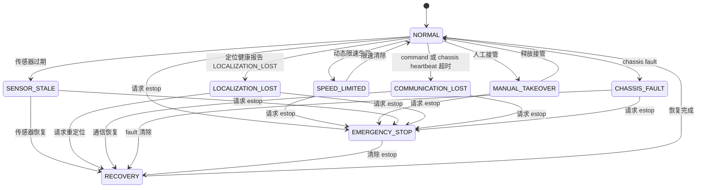

# Safety 状态机

本文档说明低速巡检 AMR 当前 Safety 状态、最终速度策略和各输入源。Phase 4A/4B 与 Phase 6
的历史演进保留在后续章节；本文档整理本身不修改安全逻辑。

## 当前 Safety 能力

当前仓库已有：

- `cmd_vel_safety_gate_node`：最终 `/cmd_vel` 发布点；
- emergency stop service：`/enable_emergency_stop`、`/clear_emergency_stop`；
- watchdog：muxed cmd_vel 超时输出零速度；
- dynamic speed limit：订阅 `/safety_state` 并限制速度；
- manual takeover 状态：订阅 `/manual_takeover/state`；
- `fault_supervisor_node`：根据 `/system_health` 请求急停或恢复；
- `system_monitor_node`：系统健康监控入口。
- `localization_health_monitor_node`：Phase 4A 发布 `/localization/health`，输出 `LOCALIZATION_UNKNOWN / OK / UNSTABLE / LOST / RECOVERING / RECOVERED`。

最终速度状态已在 Safety Gate 中统一；mission pause 和人工恢复仍按各 task/fault 流程处理。

## 状态表

| State | 当前/计划 | cmd_vel output | 暂停 mission | 人工复位 |
| --- | --- | --- | --- | --- |
| `NORMAL` | 当前概念 | 正常透传经限幅后的速度 | 否 | 否 |
| `MANUAL_TAKEOVER` | 部分已有 | 由人工接管链路决定，自动导航应让出控制 | 是 / policy TBD | 通常不需要 |
| `SPEED_LIMITED` | 已有 | 按动态限速裁剪线速度和角速度 | 否 | 否 |
| `SENSOR_STALE` | 部分已有 | 输出零速度或降级，取决于传感器类型 | 是 | TBD |
| `LOCALIZATION_LOST` | Phase 4A health output / 已集成 safety | Phase 4B 输出零速度 | 是 | 取决于 relocalization result |
| `CHASSIS_FAULT` | 已统一 | 输出零速度 | 是 | 是 |
| `COMMUNICATION_LOST` | cmd watchdog / chassis heartbeat | 输出零速度 | 是 | 取决于原因 |
| `EMERGENCY_STOP` | 已有 | 输出零速度 | 是 | 是 |
| `RECOVERY` | 部分已有 | 仅允许恢复动作或保持零速度 | 恢复前暂停 | 取决于 fault |

## 状态图


```mermaid
stateDiagram-v2
  [*] --> NORMAL
  NORMAL --> SPEED_LIMITED: 动态限速生效
  SPEED_LIMITED --> NORMAL: 限速清除
  NORMAL --> MANUAL_TAKEOVER: 人工接管
  MANUAL_TAKEOVER --> NORMAL: 释放接管
  NORMAL --> SENSOR_STALE: 传感器过期
  SENSOR_STALE --> RECOVERY: 传感器恢复
  NORMAL --> LOCALIZATION_LOST: 定位健康报告 LOCALIZATION_LOST
  LOCALIZATION_LOST --> RECOVERY: 请求重定位
  RECOVERY --> NORMAL: 恢复完成
  NORMAL --> COMMUNICATION_LOST: command 或 chassis heartbeat 超时
  COMMUNICATION_LOST --> RECOVERY: 通信恢复
  NORMAL --> CHASSIS_FAULT: chassis fault
  CHASSIS_FAULT --> RECOVERY: fault 清除
  NORMAL --> EMERGENCY_STOP: 请求 estop
  SPEED_LIMITED --> EMERGENCY_STOP: 请求 estop
  MANUAL_TAKEOVER --> EMERGENCY_STOP: 请求 estop
  SENSOR_STALE --> EMERGENCY_STOP: 请求 estop
  LOCALIZATION_LOST --> EMERGENCY_STOP: 请求 estop
  COMMUNICATION_LOST --> EMERGENCY_STOP: 请求 estop
  CHASSIS_FAULT --> EMERGENCY_STOP: 请求 estop
  EMERGENCY_STOP --> RECOVERY: 清除 estop
```

## Phase 4 历史计划与实现

- Phase 4A：`/amcl_pose` covariance、AMCL timeout 和 TF 检查进入 `/localization/health`；不直接改 `cmd_vel_safety_gate`，不强行暂停任务。
- Phase 4B 已完成：将 `LOCALIZATION_LOST` 接入 `cmd_vel_safety_gate`，并定义限速、停车和恢复映射。
- 将 safety state 与 task state、localization health、chassis fault 统一建模；
- 明确每类故障是否自动恢复、是否需要人工复位；
- 为每次安全停车记录原因、时间、输入速度和输出速度；
- 将 localization lost、communication lost、chassis fault 接入统一状态机；
- 补充 launch / shell 验收脚本和 RViz 可视化。

## Phase 4B 当前集成

Phase 4B 在 `robot_teleop` 中增加最小统一 Safety state 集成，不创建新 package，也不改变
package layout。

已实现入口：

- Helper and policy code: `src/robot_teleop/include/robot_teleop/cmd_vel_safety.hpp`
- Final command gate: `src/robot_teleop/src/cmd_vel_safety_gate_node.cpp`
- Launch parameters: `src/robot_teleop/launch/cmd_vel_stack.launch.py`
- Static check: `scripts/check_safety_state_machine.sh`
- Runtime topic check: `scripts/check_safety_runtime_topics.sh`

统一状态名称为：

| State | Priority | Output policy |
| --- | ---: | --- |
| `EMERGENCY_STOP` | 90 | 发布零 `/cmd_vel`；配置后要求人工复位。 |
| `COMMUNICATION_LOST` | 80 | 发布零 `/cmd_vel`。 |
| `CHASSIS_FAULT` | 70 | 发布零 `/cmd_vel`。 |
| `LOCALIZATION_LOST` | 60 | 发布零 `/cmd_vel`。 |
| `STOP` (perception) | 55 | 发布零 `/cmd_vel`。 |
| `SENSOR_STALE` | 50 | 发布零 `/cmd_vel`。 |
| `MANUAL_TAKEOVER` | 40 | 保持 mux/twist_mux chain 选中的 command。 |
| `SPEED_LIMITED` | 30 | 将 command 限制到配置的低速上限。 |
| `RECOVERY` | 20 | 在上层 chain 报告稳定恢复前发布零 `/cmd_vel`。 |
| `NORMAL` | 10 | 通过原始 watchdog check 后透传已有 command。 |

Safety Gate 发布：

| Topic | Type | Purpose |
| --- | --- | --- |
| `/safety/state` | `std_msgs/msg/String` | 当前解析出的 Safety state。 |
| `/safety/reason` | `std_msgs/msg/String` | 当前状态的人类可读 reason list。 |

Safety Gate 订阅：

| Topic | Type | Default role |
| --- | --- | --- |
| `/localization/health` | `std_msgs/msg/String` | `LOCALIZATION_LOST` 映射到同名状态，`LOCALIZATION_UNSTABLE` 映射到 `SPEED_LIMITED`，恢复状态映射到 `RECOVERY`。 |
| `/scan` | `sensor_msgs/msg/LaserScan` | `SENSOR_STALE` 的 freshness input。 |
| `/odom` | `nav_msgs/msg/Odometry` | `SENSOR_STALE` 的 freshness input。 |
| `/chassis/state` | `robot_interfaces/msg/ChassisState` | Chassis connectivity 与 fault-code input。 |
| `/manual_takeover/state` | `std_msgs/msg/Bool` | Manual takeover input。 |
| `/safety_state` | `robot_interfaces/msg/SafetyState` | 为兼容保留的 dynamic speed-limit / safety-stop input。 |
| `/perception/safety_event` | `robot_interfaces_perception/msg/PerceptionSafetyEvent` | Phase 6 person-derived `CLEAR`、`SPEED_LIMITED` 或 `STOP` contribution。 |

Phase 4B 默认参数：

```text
localization_health_topic="/localization/health"
scan_topic="/scan"
odom_topic="/odom"
chassis_state_topic="/chassis/state"
safety_state_topic="/safety/state"
safety_reason_topic="/safety/reason"
scan_timeout_sec=1.0
odom_timeout_sec=1.0
localization_lost_stop=true
sensor_stale_stop=true
chassis_fault_stop=true
communication_lost_stop=true
emergency_stop_requires_reset=true
speed_limited_max_linear_mps=0.15
speed_limited_max_angular_radps=0.4
```

其他实现参数为 `localization_timeout_sec`、`chassis_state_timeout_sec` 和
`safety_startup_grace_sec`，用于避免 gate 在启动最初的短窗口内把尚未到达的 runtime
input 报告为故障。

Phase 3A `status` string 的 chassis fault-code 映射：

| `fault_code` / state | Safety state |
| --- | --- |
| `NONE` | `NORMAL` |
| `CMD_TIMEOUT` | `SENSOR_STALE` |
| `HEARTBEAT_TIMEOUT` | `COMMUNICATION_LOST` |
| `BACKEND_DISCONNECTED` | `COMMUNICATION_LOST` |
| `MALFORMED_PACKET` | `CHASSIS_FAULT` |
| `ESTOP_ACTIVE` 或 `estop=1` | `EMERGENCY_STOP` |
| `connected=false` | `COMMUNICATION_LOST` |

`CMD_TIMEOUT` 映射为 `SENSOR_STALE`，因为它表示进入 chassis adapter 的 command stream
已过期，driver 已经发送零速度。更严重的 IO 和 malformed-frame 条件映射为 communication
或 chassis fault。

静态验证：

```bash
bash scripts/check_safety_state_machine.sh
```

在 bringup/Nav2/localization 运行后执行 runtime topic 验证：

```bash
bash scripts/check_safety_runtime_topics.sh
```

runtime script 只检查 topic 是否存在，不证明实体硬件 safety performance、真实 localization
recovery 或现场 emergency-stop latency。

## Phase 5B Factory Patrol Demo 观察

Factory Patrol Demo workflow 应通过以下命令观察统一 Safety state：

```bash
ros2 topic echo /safety/state
ros2 topic echo /safety/reason
```

在 temporary obstacle Demo 中，只有当 `/scan`、`/odom` 或其他 monitored input 过期时才观察
`SENSOR_STALE`；正常的 `/scan` 障碍应先由 Nav2/local costmap 处理。在 localization recovery
Demo 中，错误 pose 或 localization timeout 后观察 `LOCALIZATION_LOST`，并确认 Phase 4B
policy 是否将 `/cmd_vel` 置零。

在采集 runtime topic log 前，任何 Phase 5B 文档都不声称 Safety state transition 已在 Gazebo
通过。

## Phase 6 Perception Safety Policy

Phase 6 扩展两条既有 final gate path，不替换 `twist_mux`、Factory Patrol mux 或 Nav2。Perception
贡献如下：

| 条件 | Event | Gate state | 最终 policy |
| --- | --- | --- | --- |
| 无 eligible person 或距离 `> 3.0 m` | `CLEAR` | 无 perception restriction | 保留其他全部 safety input |
| `1.5 m <= distance <= 3.0 m` | `PERSON_NEAR` | `SPEED_LIMITED` | 限制到 `0.15 m/s`、`0.4 rad/s` |
| distance `< 1.5 m` | `PERSON_TOO_CLOSE` | `STOP` | 最终 `/cmd_vel` 置零 |
| person 位于配置的 map danger zone | `PERSON_IN_DANGER_ZONE` | `STOP` | 无论距离都将最终 `/cmd_vel` 置零 |

人员距离是 observation-time robot pose 下的 map-frame 平面 XY distance。策略等待 TargetManager
进入 `CONFIRMED`；已经 `PROCESSED` 的 person 仍可参与 safety，因为 mission completion 不能
关闭人员安全。多个 person 取最严格结果，再用最短距离和 target ID 做确定性 tie break。

限制立即生效。较宽松的结果必须连续观察三次；STOP 保持锁存直到距离超过 `1.7 m`，
SPEED_LIMITED 保持锁存直到距离超过 `3.2 m`。`LOST`、缺失或 stale target 只能通过这个有界
的三次 observation recovery 参与恢复。Malformed input 不能发布虚假 `CLEAR`。

Gate subscriber 只接受来自 `robot_perception` 的 valid、ordered、non-future event。在
ROS/simulation time 中超过 `1.5 s` 的 event 只移除 perception-derived contribution，不会
清除 estop、localization、chassis、scan、watchdog 或 legacy safety condition。这样既避免
过期的 perception STOP 长期锁存，也保留项目原有安全原则。

Diagnostics 使用 `/safety/state` 和 `/safety/reason`；Perception reason 为
`PERCEPTION_PERSON_NEAR`、`PERCEPTION_PERSON_TOO_CLOSE` 和
`PERCEPTION_PERSON_IN_DANGER_ZONE`.
