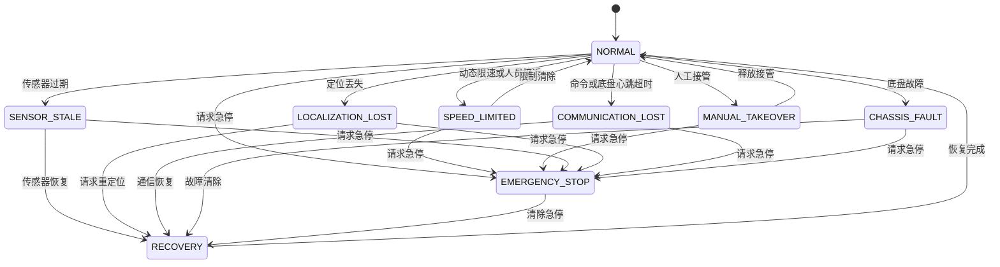

# Safety 状态机

Safety Gate 是最终 `/cmd_vel` 的唯一发布边界。它在速度仲裁之后合并 watchdog、急停、
传感器、定位、底盘、人工接管、legacy safety state 和视觉人员安全事件，并采用最高优先级
的活动状态。

## 安全与控制数据流

```text
Nav2 / teleop / tracking
  -> cmd_vel mux
  -> Safety Gate
       + estop / watchdog
       + scan / odom freshness
       + localization health
       + chassis state
       + manual takeover
       + perception safety event
  -> /cmd_vel
```

真实底盘 bringup 使用 `twist_mux` 后接 `cmd_vel_safety_gate_node`。Factory Patrol 仿真使用
`cmd_vel_mux_node` 在同一进程中实现相同的仲裁与最终安全解析。Perception 只发布语义安全
事件，不直接修改 Twist。

## 状态与优先级

| State | Priority | 输出策略 |
| --- | ---: | --- |
| `EMERGENCY_STOP` | 90 | 最终速度为零；按配置要求人工复位。 |
| `COMMUNICATION_LOST` | 80 | 最终速度为零。 |
| `CHASSIS_FAULT` | 70 | 最终速度为零。 |
| `LOCALIZATION_LOST` | 60 | 最终速度为零。 |
| `STOP`（perception） | 55 | 最终速度为零。 |
| `SENSOR_STALE` | 50 | 最终速度为零。 |
| `MANUAL_TAKEOVER` | 40 | 保持 mux/twist_mux 选中的人工命令。 |
| `SPEED_LIMITED` | 30 | 裁剪到配置的低速上限。 |
| `RECOVERY` | 20 | 上层输入恢复稳定前保持零速度。 |
| `NORMAL` | 10 | 通过 watchdog 后透传仲裁命令。 |

## 状态图


```mermaid
stateDiagram-v2
  [*] --> NORMAL
  NORMAL --> SPEED_LIMITED: 动态限速或人员接近
  SPEED_LIMITED --> NORMAL: 限制清除
  NORMAL --> MANUAL_TAKEOVER: 人工接管
  MANUAL_TAKEOVER --> NORMAL: 释放接管
  NORMAL --> SENSOR_STALE: 传感器过期
  SENSOR_STALE --> RECOVERY: 传感器恢复
  NORMAL --> LOCALIZATION_LOST: 定位丢失
  LOCALIZATION_LOST --> RECOVERY: 请求重定位
  RECOVERY --> NORMAL: 恢复完成
  NORMAL --> COMMUNICATION_LOST: 命令或底盘心跳超时
  COMMUNICATION_LOST --> RECOVERY: 通信恢复
  NORMAL --> CHASSIS_FAULT: 底盘故障
  CHASSIS_FAULT --> RECOVERY: 故障清除
  NORMAL --> EMERGENCY_STOP: 请求急停
  SPEED_LIMITED --> EMERGENCY_STOP: 请求急停
  MANUAL_TAKEOVER --> EMERGENCY_STOP: 请求急停
  SENSOR_STALE --> EMERGENCY_STOP: 请求急停
  LOCALIZATION_LOST --> EMERGENCY_STOP: 请求急停
  COMMUNICATION_LOST --> EMERGENCY_STOP: 请求急停
  CHASSIS_FAULT --> EMERGENCY_STOP: 请求急停
  EMERGENCY_STOP --> RECOVERY: 清除急停
```

## 输入与输出

Safety Gate 发布：

| Topic | Type | 用途 |
| --- | --- | --- |
| `/cmd_vel` | `geometry_msgs/msg/Twist` | 最终底盘速度。 |
| `/safety/state` | `std_msgs/msg/String` | 当前解析出的状态。 |
| `/safety/reason` | `std_msgs/msg/String` | 当前活动原因列表。 |

主要订阅：

| Topic | Type | 默认映射 |
| --- | --- | --- |
| `/localization/health` | `std_msgs/msg/String` | LOST 停车，UNSTABLE 限速，恢复状态进入 `RECOVERY`。 |
| `/scan` | `sensor_msgs/msg/LaserScan` | freshness 超时产生 `SENSOR_STALE`。 |
| `/odom` | `nav_msgs/msg/Odometry` | freshness 超时产生 `SENSOR_STALE`。 |
| `/chassis/state` | `robot_interfaces/msg/ChassisState` | 连接、心跳与 fault code。 |
| `/manual_takeover/state` | `std_msgs/msg/Bool` | 人工接管状态。 |
| `/safety_state` | `robot_interfaces/msg/SafetyState` | 兼容既有动态限速和停车输入。 |
| `/perception/safety_event` | `robot_interfaces_perception/msg/PerceptionSafetyEvent` | 人员 `CLEAR`、`SPEED_LIMITED` 或 `STOP`。 |

急停服务为 `/enable_emergency_stop` 和 `/clear_emergency_stop`。`fault_supervisor_node` 可根据
`/system_health` 请求急停或恢复。

## 当前关键参数

```text
localization_health_topic="/localization/health"
scan_topic="/scan"
odom_topic="/odom"
chassis_state_topic="/chassis/state"
safety_state_topic="/safety/state"
safety_reason_topic="/safety/reason"
scan_timeout_sec=1.0
odom_timeout_sec=1.0
localization_lost_stop=true
sensor_stale_stop=true
chassis_fault_stop=true
communication_lost_stop=true
emergency_stop_requires_reset=true
speed_limited_max_linear_mps=0.15
speed_limited_max_angular_radps=0.4
```

`localization_timeout_sec`、`chassis_state_timeout_sec` 和 `safety_startup_grace_sec` 用于区分
真实超时与节点启动阶段尚未到达的输入。

## 定位与底盘映射

| Localization health | Safety state |
| --- | --- |
| `LOCALIZATION_OK` | `NORMAL` |
| `LOCALIZATION_UNSTABLE` | `SPEED_LIMITED` |
| `LOCALIZATION_LOST` | `LOCALIZATION_LOST` |
| `LOCALIZATION_RECOVERING` / `LOCALIZATION_RECOVERED` | `RECOVERY` |

| Chassis `fault_code` / state | Safety state |
| --- | --- |
| `NONE` | `NORMAL` |
| `CMD_TIMEOUT` | `SENSOR_STALE` |
| `HEARTBEAT_TIMEOUT`、`BACKEND_DISCONNECTED`、`connected=false` | `COMMUNICATION_LOST` |
| `MALFORMED_PACKET` | `CHASSIS_FAULT` |
| `ESTOP_ACTIVE` 或 `estop=1` | `EMERGENCY_STOP` |

`CMD_TIMEOUT` 表示进入 chassis adapter 的命令流过期，driver 已经发送零速度；IO 断开和
非法帧分别归入通信或底盘故障。

## Perception Safety Policy

人员安全策略使用 observation-time `map -> base_link` 计算当前可见 confirmed person 的
map-frame 平面距离：

| 条件 | Event | Gate state | 最终策略 |
| --- | --- | --- | --- |
| 无 eligible person 或距离 `> 3.0 m` | `CLEAR` | 无感知限制 | 保留其他安全输入 |
| `1.5 m <= distance <= 3.0 m` | `PERSON_NEAR` | `SPEED_LIMITED` | 限制到 `0.15 m/s`、`0.4 rad/s` |
| distance `< 1.5 m` | `PERSON_TOO_CLOSE` | `STOP` | 最终速度为零 |
| person 位于 map danger zone | `PERSON_IN_DANGER_ZONE` | `STOP` | 最终速度为零 |

多个 person 取最严格结果，并使用最短距离和 target ID 做确定性 tie break。限制立即生效；
恢复到更宽松状态需要连续三个有效 observation。STOP 的清除阈值为 `1.7 m`，限速的清除
阈值为 `3.2 m`。Malformed input 不发布虚假 `CLEAR`。

Gate 只接受来自 `robot_perception` 的 valid、ordered、non-future event。事件在 ROS/simulation
time 中超过 `1.5 s` 后只移除 perception contribution，不能清除急停、定位、底盘、scan、
watchdog 或其他安全条件。

## Diagnostics 与验证

Perception 原因通过 `/safety/reason` 表示为 `PERCEPTION_PERSON_NEAR`、
`PERCEPTION_PERSON_TOO_CLOSE` 或 `PERCEPTION_PERSON_IN_DANGER_ZONE`。

```bash
bash scripts/check_safety_state_machine.sh
bash scripts/check_safety_runtime_topics.sh
ros2 topic echo /safety/state
ros2 topic echo /safety/reason
```

Factory Patrol 的 temporary-obstacle 与 localization-recovery workflow 可用于观察输入变化；
正常激光障碍首先由 Nav2/local costmap 处理，只有传感器过期才产生 `SENSOR_STALE`。

## 已知限制

- 现有结论是 WSL2/Gazebo 与软件层验证，不是 functional-safety certification。
- topic presence 检查不能替代实体急停延迟、制动距离或硬件故障注入。
- Mission pause 和人工恢复由各 task/fault workflow 处理，不完全等同于速度 Gate 状态。
